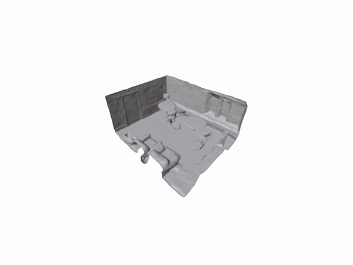
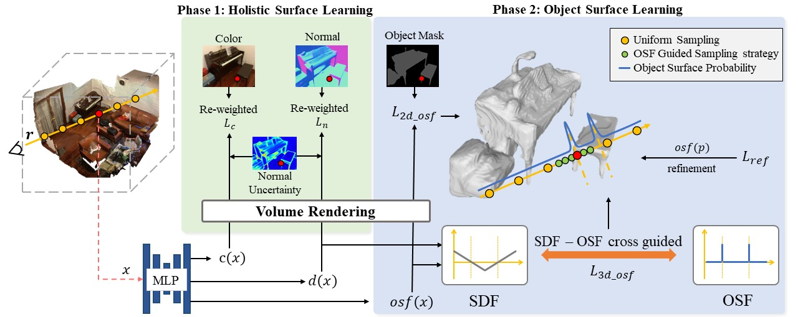

<p align="center">

<h1 align="center">H<sub>2</sub>O-SDF: Two-phase Learning for 3D Indoor Reconstruction using Object Surface Fields</h1>
<p align="center"> [Minyoung Park](https://www.linkedin.com/in/minyoung-park-6636a9203), Mirae Do, Yeon Jae Shin, Jaeseok Yoo, Jongkwang Hong, Joongrock Kim, Chul Lee</p>

  <h2 align="center">ICLR 2024 (Spotlight)</h2>
  <h3 align="center"><a href="https://arxiv.org/abs/2402.08138">Paper</a> | <a href="https://domirae.github.io/">Project Page</a> </h3>
  <div align="center"></div>
</p>

<p align="center">
  
</p>


## Method




## Citation

If you find this work useful in your research, please cite:
```txt
@misc{park2024h2osdf,
      title={H2O-SDF: Two-phase Learning for 3D Indoor Reconstruction using Object Surface Fields}, 
      author={Minyoung Park and Mirae Do and YeonJae Shin and Jaeseok Yoo and Jongkwang Hong and Joongrock Kim and Chul Lee},
      year={2024},
      eprint={2402.08138},
      archivePrefix={arXiv},
      primaryClass={cs.CV}
}
```
